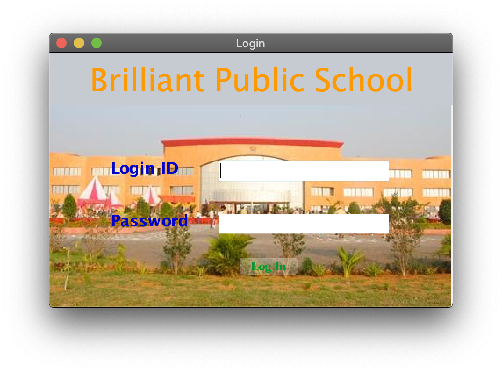
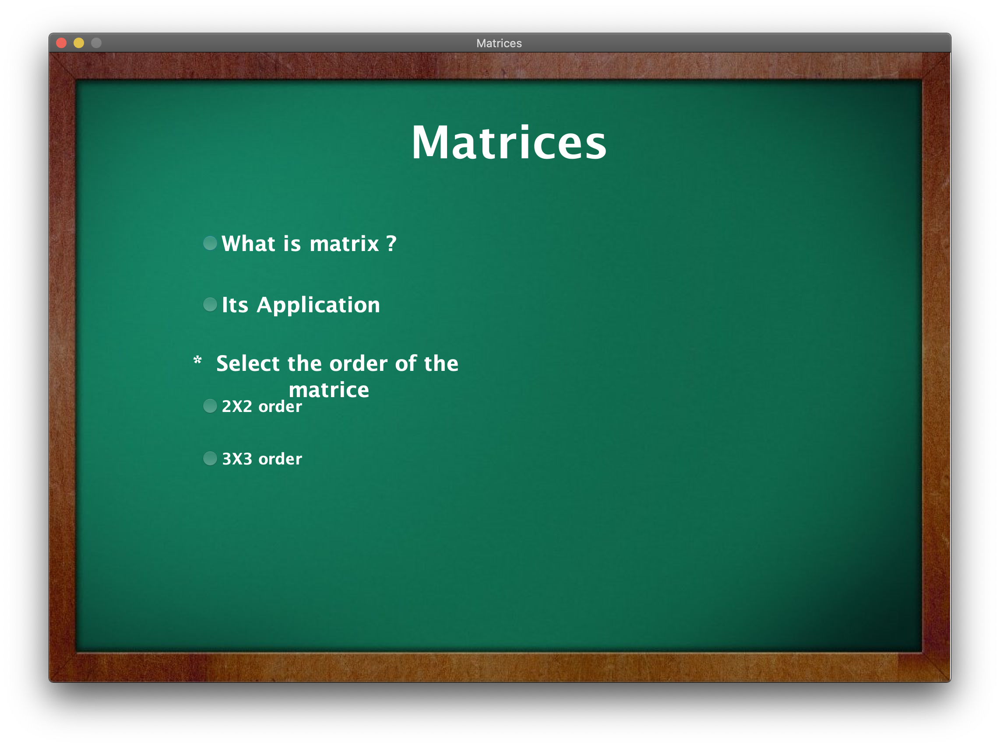
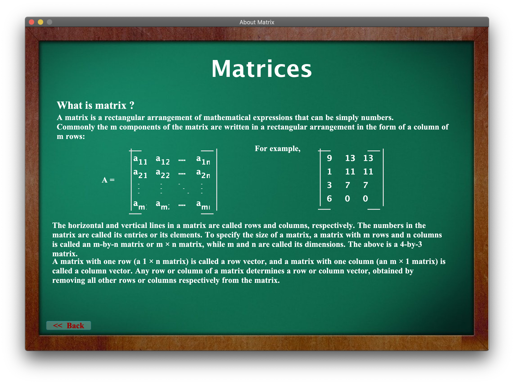
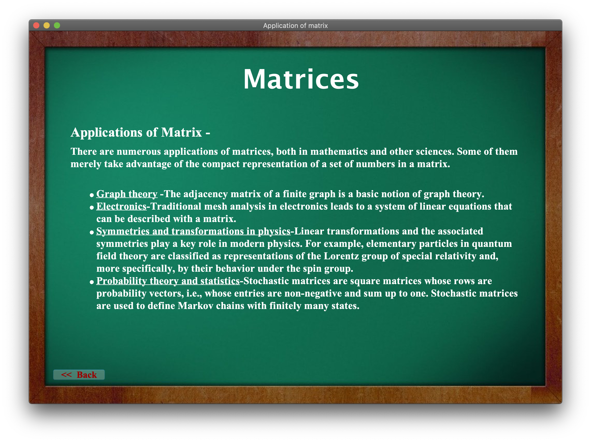
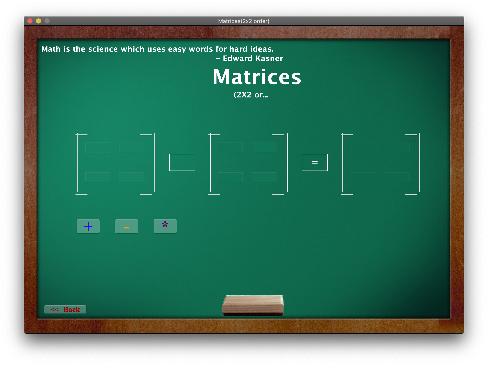
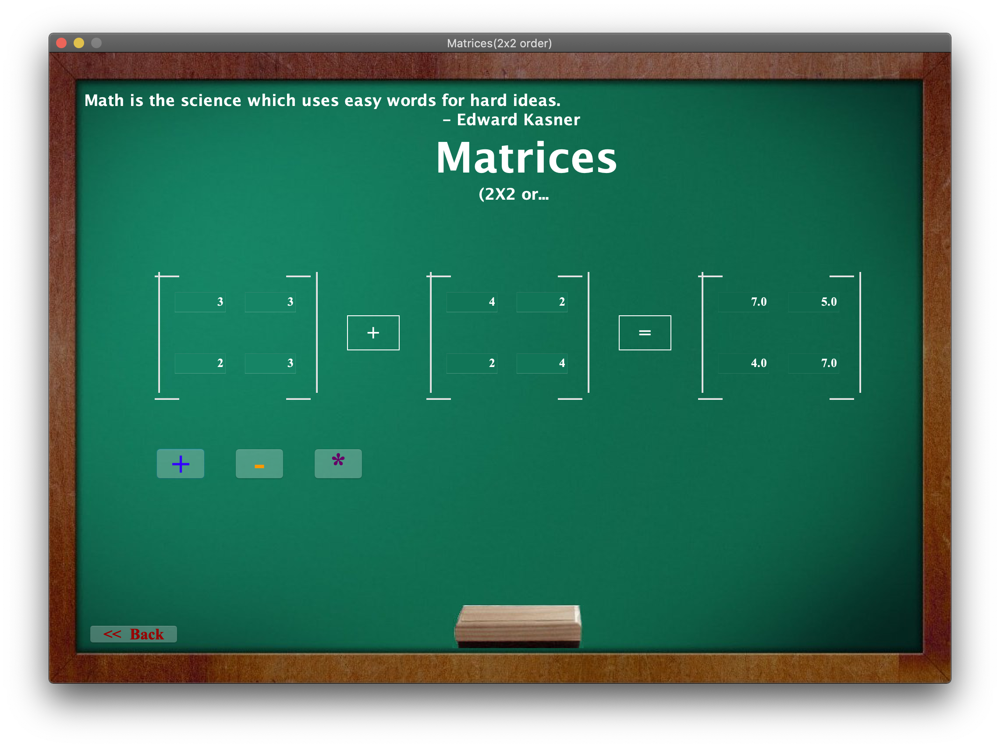
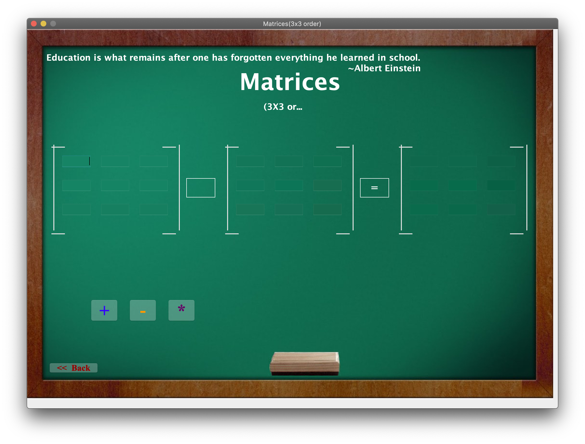

# Matrix-Java-GUI

GUI based application in Java - From class 11th [2011-12]

## How to Run:
 - go to Matrix/dist/  and open  Matrix.jar

[must installed JDK]

```
id:bps  pass:bps

```








